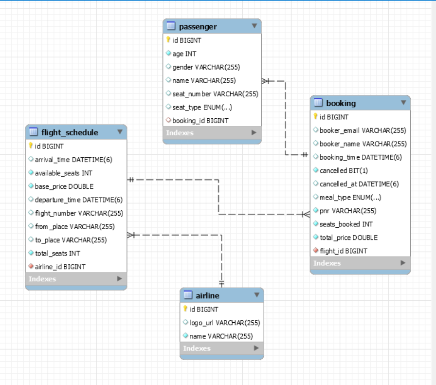
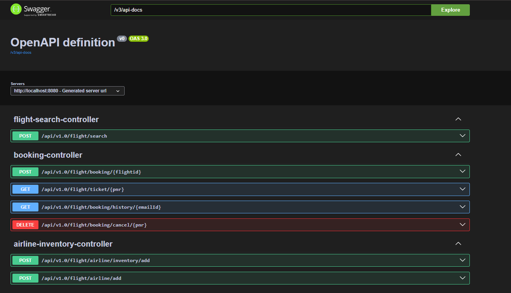

# ✈️ Flight Booking System — Spring Boot Project

A complete backend application built using **Spring Boot 3**, **MySQL**, **Spring Data JPA**, **Mockito tests**, and **Springdoc Swagger UI**.  
This project allows airlines to add schedules, users to search flights, book tickets, view bookings, and cancel tickets — all through REST APIs.

---

## 📘 Features

### ✔ Airline Module
- Add airline details  
- Add flight inventory (schedules) for an airline  

### ✔ Flight Search
- Search flights based on source, destination, and journey date  
- Supports penalty-based pricing (e.g., premium seats have additional cost)

### ✔ Booking Module
- Book flight tickets  
- Generate PNR  
- Store passenger details  
- Retrieve ticket using PNR  
- View booking history using email  
- Cancel bookings (only if > 24 hours before departure)

### ✔ Technology Stack

| Layer | Technology |
|-------|------------|
| Backend | **Spring Boot 3**, Spring Web |
| Database | **MySQL 8** |
| ORM | Spring Data JPA (Hibernate) |
| Testing | **JUnit 5**, **Mockito**, MockMvc |
| Documentation | **Swagger / Springdoc OpenAPI** |
| Build Tool | Maven |

---

## 🗂 Project Structure

```
src/
 ├── main/
 │    ├── java/com/flightapp/
 │    │     ├── controller/        
 │    │     ├── service/           
 │    │     ├── repository/        
 │    │     ├── model/             
 │    │     ├── dto/               
 │    │     ├── enums/             
 │    │     └── exception/         
 │    └── resources/
 │          ├── application.properties  
 │          └── schema.sql / data.sql
 │
 └── test/
       └── controller/              
```

---

## ⚙️ Setup Instructions

### 1️⃣ Prerequisites
- Java 17+  
- MySQL installed  
- Maven installed  

---

## 2️⃣ Configure Database

```sql
CREATE DATABASE flightapp;
```

`application.properties`:

```properties
spring.datasource.url=jdbc:mysql://localhost:3306/flightapp
spring.datasource.username=root
spring.datasource.password=your_password
spring.jpa.hibernate.ddl-auto=update
spring.jpa.show-sql=true
springdoc.swagger-ui.path=/swagger-ui/index.html
```

---

## 3️⃣ Build & Run the Application

```bash
mvn clean install
mvn spring-boot:run
```

---

## ER Diagram


## 📑 Swagger API Documentation

- Swagger_UI_Image


---

## 🚀 Available API Endpoints

### Airline
| Method | Endpoint | Description |
|--------|----------|-------------|
| POST | `/api/v1.0/flight/airline/add` | Add new airline |
| POST | `/api/v1.0/flight/airline/inventory/add?airlineId={id}` | Add flight schedule |

### Search
| Method | Endpoint | Description |
|--------|----------|-------------|
| POST | `/api/v1.0/flight/search` | Search flights |

### Booking
| Method | Endpoint | Description |
|--------|----------|-------------|
| POST | `/api/v1.0/flight/booking/{flightId}` | Book ticket |
| GET | `/api/v1.0/flight/ticket/{pnr}` | Get ticket details |
| GET | `/api/v1.0/flight/booking/history/{email}` | Booking history |
| DELETE | `/api/v1.0/flight/booking/cancel/{pnr}` | Cancel booking |

---

## 🧪 Unit Testing (Mockito + MockMvc)

Includes:
- Controller-level tests  
- Service mock tests  
- Validation tests  
- JSON serialization tests  

Run:

```bash
mvn test
```

---

## 💰 Penalty-Based Pricing

Some seats like **WINDOW** have extra penalty added.  
Final price = basePrice + seatPenalty.

---

## ❌ No Authentication

Project does **not** include login/auth because assignment didn’t require it.

---

## 📦 Excel API Documentation Included

`API_ENDPOINTS.xlsx`

---

## 👩‍💻 Author

**Sravanthi Gurram**  
Flight Booking System 

